# AndroidLibrary
If I have been able to see further, it was only because I stood on the shoulders of giants.

***
&nbsp;&nbsp;&nbsp;&nbsp;[UI](#ui)  
&nbsp;&nbsp;&nbsp;&nbsp;&nbsp;|---[Widgets](#widgets)  
&nbsp;&nbsp;&nbsp;&nbsp;&nbsp;|&nbsp;&nbsp;&nbsp;&nbsp;&nbsp;&nbsp;&nbsp;&nbsp;&nbsp; |---[TextView](#textview)  
&nbsp;&nbsp;&nbsp;&nbsp;&nbsp;|&nbsp;&nbsp;&nbsp;&nbsp;&nbsp;&nbsp;&nbsp;&nbsp;&nbsp; |---[EditText](#edittext)  
&nbsp;&nbsp;&nbsp;&nbsp;&nbsp;|&nbsp;&nbsp;&nbsp;&nbsp;&nbsp;&nbsp;&nbsp;&nbsp;&nbsp; |---[Button](#button)  
&nbsp;&nbsp;&nbsp;&nbsp;&nbsp;|&nbsp;&nbsp;&nbsp;&nbsp;&nbsp;&nbsp;&nbsp;&nbsp;&nbsp; |---[ImageView](#imageview)  
&nbsp;&nbsp;&nbsp;&nbsp;&nbsp;|&nbsp;&nbsp;&nbsp;&nbsp;&nbsp;&nbsp;&nbsp;&nbsp;&nbsp; |---[ProgressBar](#progressbar)  
&nbsp;&nbsp;&nbsp;&nbsp;&nbsp;|&nbsp;&nbsp;&nbsp;&nbsp;&nbsp;&nbsp;&nbsp;&nbsp;&nbsp; |---[ActionBar](#actionbar)    
&nbsp;&nbsp;&nbsp;&nbsp;&nbsp;|&nbsp;&nbsp;&nbsp;&nbsp;&nbsp;&nbsp;&nbsp;&nbsp;&nbsp; |---[ListView](#listview)  
&nbsp;&nbsp;&nbsp;&nbsp;&nbsp;|&nbsp;&nbsp;&nbsp;&nbsp;&nbsp;&nbsp;&nbsp;&nbsp;&nbsp; |---[GridView](#gridview)  
&nbsp;&nbsp;&nbsp;&nbsp;&nbsp;|&nbsp;&nbsp;&nbsp;&nbsp;&nbsp;&nbsp;&nbsp;&nbsp;&nbsp; |---[ScrollView](#scrollview)  
&nbsp;&nbsp;&nbsp;&nbsp;&nbsp;|&nbsp;&nbsp;&nbsp;&nbsp;&nbsp;&nbsp;&nbsp;&nbsp;&nbsp; |---[ViewPaper](#viewpaper)  
&nbsp;&nbsp;&nbsp;&nbsp;&nbsp;|&nbsp;&nbsp;&nbsp;&nbsp;&nbsp;&nbsp;&nbsp;&nbsp;&nbsp; |---[Sliding Views](#slidingviews)  
&nbsp;&nbsp;&nbsp;&nbsp;&nbsp;|---[Dialogs](#dialogs)  
&nbsp;&nbsp;&nbsp;&nbsp;&nbsp;|---[Toasts](#toastsui)  
&nbsp;&nbsp;&nbsp;&nbsp;&nbsp;|---[Animation](#animationui)   
&nbsp;&nbsp;&nbsp;&nbsp;&nbsp;|---[Charts](#chartsui)  
&nbsp;&nbsp;&nbsp;&nbsp;&nbsp;|---[Other](#otherui)  
&nbsp;&nbsp;&nbsp;&nbsp;[Material Design](#material)  
&nbsp;&nbsp;&nbsp;&nbsp;[Location](#location)  
&nbsp;&nbsp;&nbsp;&nbsp;[Social](#social)  
&nbsp;&nbsp;&nbsp;&nbsp;[DB & Preferences](#database)  
&nbsp;&nbsp;&nbsp;&nbsp;&nbsp;|&nbsp;&nbsp;&nbsp;&nbsp;&nbsp;&nbsp;&nbsp;&nbsp;&nbsp; |---[ContentProvider / ContentResolver / Cursor](#databasecp)  
&nbsp;&nbsp;&nbsp;&nbsp;&nbsp;|&nbsp;&nbsp;&nbsp;&nbsp;&nbsp;&nbsp;&nbsp;&nbsp;&nbsp; |---[Preferences](#databasepreferences)  
&nbsp;&nbsp;&nbsp;&nbsp;&nbsp;|&nbsp;&nbsp;&nbsp;&nbsp;&nbsp;&nbsp;&nbsp;&nbsp;&nbsp; |---[Other](#databaseother)  

&nbsp;&nbsp;&nbsp;&nbsp;[IO](#io)  
&nbsp;&nbsp;&nbsp;&nbsp;[Network](#network)  
&nbsp;&nbsp;&nbsp;&nbsp;[Event Bus](#eventbus)  
&nbsp;&nbsp;&nbsp;&nbsp;[Tasks](#tasks)  
&nbsp;&nbsp;&nbsp;&nbsp;[Open GL](#opengl)  
&nbsp;&nbsp;&nbsp;&nbsp;[Dependency Injection](#dependencyinjection)  
&nbsp;&nbsp;&nbsp;&nbsp;[Testing](#testing)  
&nbsp;&nbsp;&nbsp;&nbsp;[Reverse Engineering](#reverseengineering)  
&nbsp;&nbsp;&nbsp;&nbsp;[Bluetooth](#bluetooth)  
&nbsp;&nbsp;&nbsp;&nbsp;[Scan](#scan)  
&nbsp;&nbsp;&nbsp;&nbsp;[File Pickers](#filepickers) 

## <a name="ui">UI

### <a name="widgets">Widgets

#### <a name="textview">TextView
Title | Description | ScreenShot
:-----------: | :-----------: | :-----------:
[AwesomeText](https://github.com/JMPergar/AwesomeText) | A tool that facilitates working with Spans on TextViews or any extension of them (EditTexts, Buttons...)|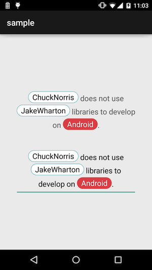
[TimelyTextView](https://github.com/adnan-SM/TimelyTextView) | Animated TextView like Timely app.|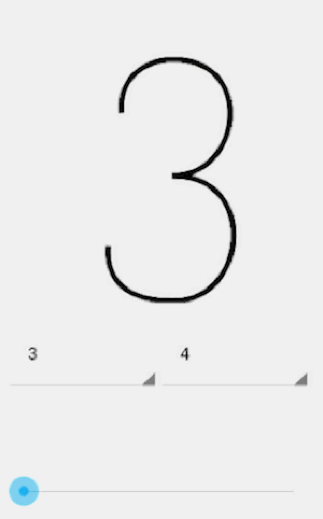
[SecretTextView](https://github.com/matthewrkula/SecretTextView) | A TextView that simulates the effect from the app Secret where the characters fade in/out at different speeds.|
[Titanic](https://github.com/RomainPiel/Titanic) | Android experiment showing a sinking TextView.|
[BabushkaText](https://github.com/quiqueqs/BabushkaText) | A simpler way to style your TextViews.|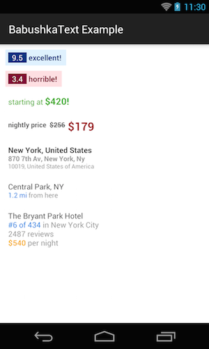
[ExpandableTextView](https://github.com/Manabu-GT/ExpandableTextView) | Android's TextView that can expand/collapse like the Google Play's app description.|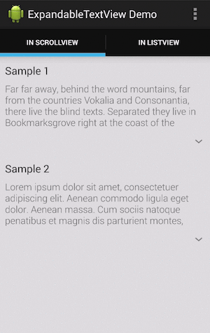
[AutoFitTextView](https://github.com/AndroidDeveloperLB/AutoFitTextView) | A TextView that automatically fit its font and line count based on its available size and content.|
[MagicViews](https://github.com/ikocijan/MagicViews) | Set custom font in Android application.|
[Shimmer-android](https://github.com/RomainPiel/Shimmer-android) | An Android TextView with a shimmering effect.|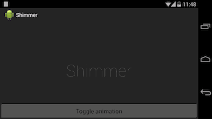
[JumpingBeans](https://github.com/frakbot/JumpingBeans) | A Span-based library to make your text jump like Mexican beans. Oh, and the "..."s in Hangouts.|

#### <a name="edittext">EditText
Title | Description | ScreenShot
:-----------: | :-----------: | :-----------:
[floatlabelededittext](https://github.com/wrapp/floatlabelededittext) | Floating hint from edit text.|
[android-edittext-validator](https://github.com/vekexasia/android-edittext-validator) | Android form edit text is an extension of EditText that brings data validation facilities to the edittext.|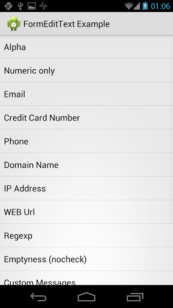

#### <a name="button">Button
Title | Description | ScreenShot
:-----------: | :-----------: | :-----------:
[android-process-button](https://github.com/dmytrodanylyk/android-process-button) | Android Buttons With Built-in Progress Meters.|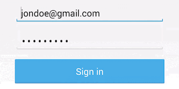
[android-flat-button](https://github.com/hoang8f/android-flat-button) | FButton - a flat button library for Android.|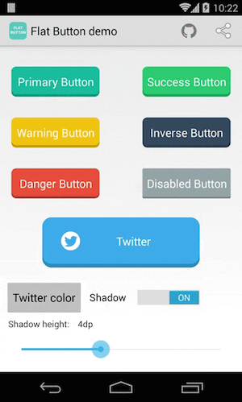
[android-circlebutton](https://github.com/markushi/android-circlebutton/) | Circle button widget for Android.|
[Android-Bootstrap](https://github.com/Bearded-Hen/Android-Bootstrap) | Bootstrap style buttons with Font Awesome.|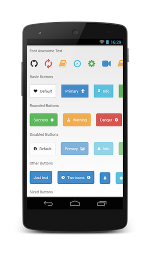
[circular-progress-button](https://github.com/dmytrodanylyk/circular-progress-button) | Android Circular Progress Button.|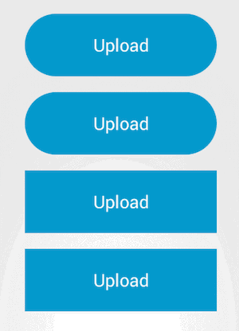
[SwitchButton](https://github.com/kyleduo/SwitchButton) | A cute widget of Switch Button for you to create beautiful and friendly UI.|

#### <a name="imageview">ImageView
Title | Description | ScreenShot
:-----------: | :-----------: | :-----------:
[ColorArt](https://github.com/MichaelEvans/ColorArt) | ColorArt is a library that uses an image to create a themed image/text display.|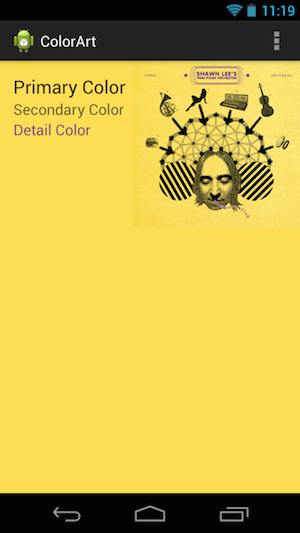
[TextDrawable](https://github.com/amulyakhare/TextDrawable) | It extends the Drawable class thus can be used with existing/custom/network ImageView classes. Also included is a fluent interface for creating drawables and a customizable ColorGenerator.|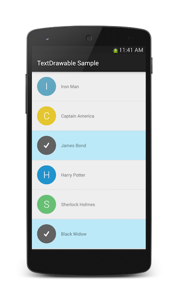
[SelectableRounded](https://github.com/pungrue26/SelectableRoundedImageView) | Android ImageView that supports different radii on each corner.|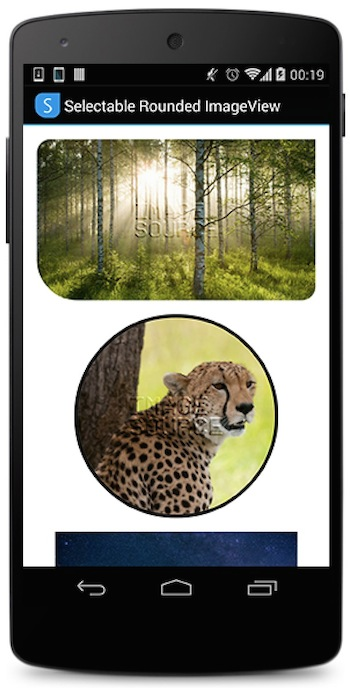
[CircleImageView](https://github.com/hdodenhof/CircleImageView) | A circular ImageView for Android.|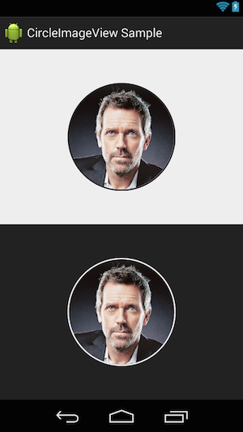
[CustomShapeImage](https://github.com/MostafaGazar/CustomShapeImageView) | Custom shape ImageView using PorterDuffXfermode with paint shapes and SVGs.|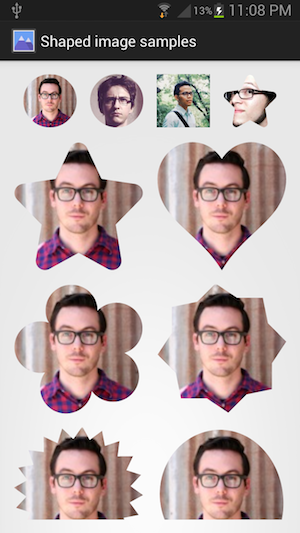
[PhotoView](https://github.com/chrisbanes/PhotoView) | Implementation of ImageView for Android that supports zooming, by various touch gestures.| 		None    	
[android-gif-drawable](https://github.com/koral--/android-gif-drawable) | Views and Drawable for displaying animated GIFs on Android.| 		None		

#### <a name="progressbar">ProgressBar
Title | Description | ScreenShot
:-----------: | :-----------: | :-----------:
[SmoothProgressBar](https://github.com/castorflex/SmoothProgressBar) | A small Android library allowing you to have a smooth and customizable horizontal indeterminate ProgressBar.|
[dashed-circular-progress](https://github.com/glomadrian/dashed-circular-progress) | A Circular progress animated where you can put any view inside.|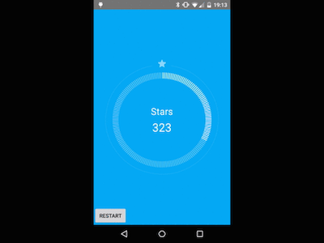
[WaveView](https://github.com/john990/WaveView) | A wave view of android,can be used as progress bar.|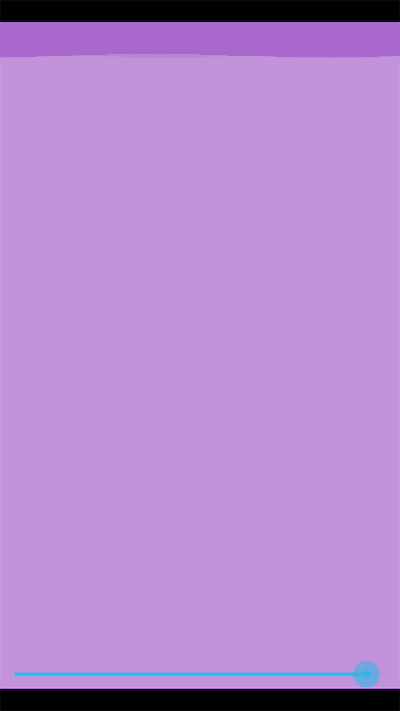
[CircleProgress](https://github.com/lzyzsd/CircleProgress) | CircleProgress, DonutProgress, ArcProgress.|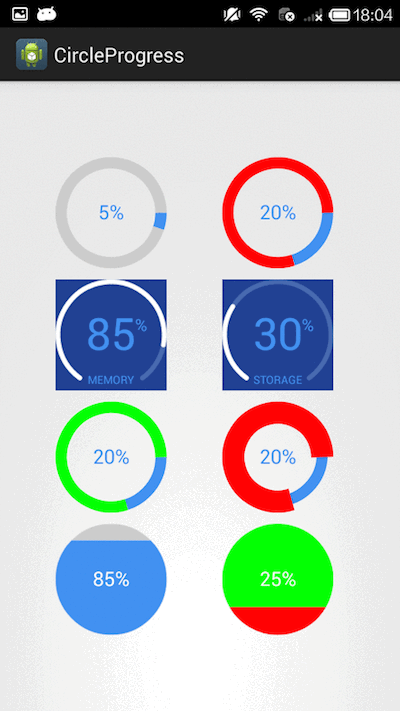
[RoundCornerProgressBar](https://github.com/akexorcist/Android-RoundCornerProgressBar) | Round Corner Progress Bar Library for Android.|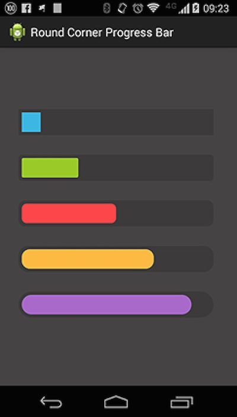
[NumberProgressBar](https://github.com/daimajia/NumberProgressBar) | A beautiful, slim Android ProgressBar.|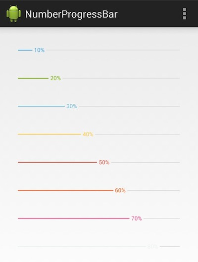

#### <a name="actionbar">ActionBar
Title | Description | ScreenShot
:-----------: | :-----------: | :-----------:
[NotBoringActionBar](https://github.com/flavienlaurent/NotBoringActionBar) | News Stand app makes the ActionBar not boring.|
[FadingActionBar](https://github.com/ManuelPeinado/FadingActionBar) | Android library implementing a fading effect for the action bar, similar to the one found in the Play Music app.|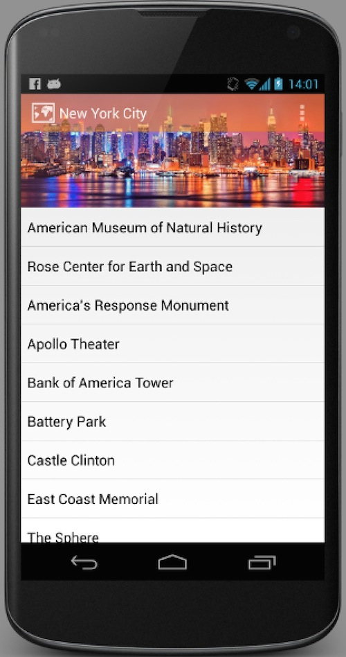

#### <a name="listview">ListView
Title | Description | ScreenShot
:-----------: | :-----------: | :-----------:
[ListViewAnimations](https://github.com/nhaarman/ListViewAnimations) | An Android library which allows developers to easily add animations to ListView items.|
[android-swipelistview](https://github.com/47deg/android-swipelistview) | An Android List View implementation with support for drawable cells and many other swipe related features.|
[JazzyListView](https://github.com/twotoasters/JazzyListView) | JazzyListView is an extension of ListView designed to animate list item views as they become visible.| None
[MultiChoiceAdapter](https://github.com/ManuelPeinado/MultiChoiceAdapter) | A ListView adapter with support for multiple choice modal selection.| 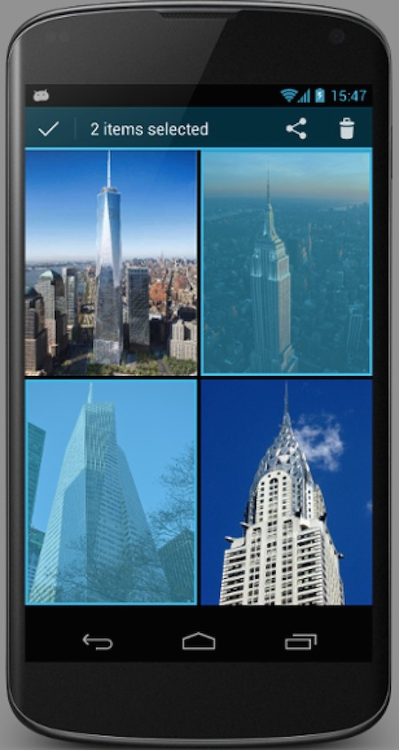
[PagedHeadListView](https://github.com/JorgeCastilloPrz/PagedHeadListView) | Android boosted ListView supporting paginated header with a new material page indicator.| 
[HorizontalVariableListView](https://github.com/sephiroth74/HorizontalVariableListView) | Horizontal list view for Android which allows variable items widths.| None
[SuperListview](https://github.com/dommerq/SuperListview) | Way more than just a listview.| None
[StickyListHeaders](https://github.com/emilsjolander/StickyListHeaders) | An android library for section headers that stick to the top.| 
[pinned-section-listview](https://github.com/beworker/pinned-section-listview) | Easy to use ListView with pinned sections for Android.| 
[AStickyHeader](https://github.com/DWorkS/AStickyHeader) | AStickyHeader is a simple library for adding Sticky Headers to ListView or GridView. Usage is very simple, it supports all kinds of Adapters.| None
[PullZoomView](https://github.com/Frank-Zhu/PullZoomView) | An Android custom ListView and ScrollView with pull to zoom-in.| 

#### <a name="gridview">GridView
Title | Description | ScreenShot
:-----------: | :-----------: | :-----------:
[AsymmetricGridView](https://github.com/felipecsl/AsymmetricGridView) | Android ListView that mimics a GridView with asymmetric items. Supports items with row span and column span.|
[FreeFlow](https://github.com/Comcast/FreeFlow) | A layout engine that decouples layouts from the View containers that manage scrolling and view recycling. It makes it really easy to create custom layouts and beautiful transition animations as data and layouts change.|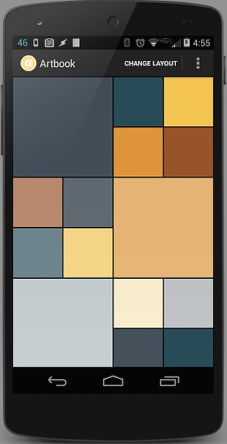
[AndroidStaggeredGrid](https://github.com/etsy/AndroidStaggeredGrid) | An Android staggered grid view which supports multiple columns with rows of varying sizes.|
[two-way-gridview](https://github.com/jess-anders/two-way-gridview) | An Android GridView that can be configured to scroll horizontally or vertically.| None
[DynamicGrid](https://github.com/askerov/DynamicGrid) | Drag and drop GridView for Android.|
[GridViewWithHeaderAndFooter](https://github.com/liaohuqiu/android-GridViewWithHeaderAndFooter) | GridView with Header and Footer.|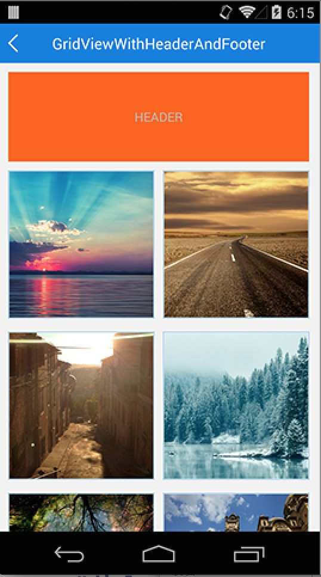
[PagingGridView](https://github.com/nicolasjafelle/PagingGridView) | A Paging GridView with the same behavior as PagingListView.| None

#### <a name="scrollview">ScrollView
Title | Description | ScreenShot
:-----------: | :-----------: | :-----------:
[discrollview](https://github.com/flavienlaurent/discrollview) | Scroll + discover = DiscrollView.|
[BooheeScrollView](https://github.com/zhaozhentao/BooheeScrollView) | interesting scrollview.|

#### <a name="viewpager">ViewPager
Title | Description | ScreenShot
:-----------: | :-----------: | :-----------:
[MultiViewPager](https://github.com/Pixplicity/MultiViewPager) | The MultiViewPager allows the pages to be wider or narrower than the ViewPager itself. It takes care of aligning the pages next to each other, and always keeping the selected page centered.|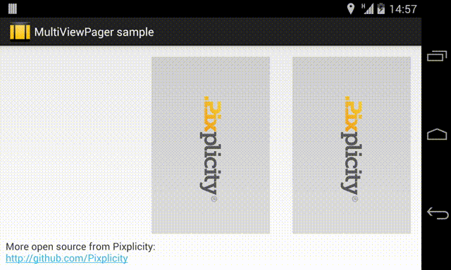
[freepager](https://github.com/alexzaitsev/freepager) | ViewPagers library for Android.|
[parallaxviewpager](https://github.com/andraskindler/parallaxviewpager) | An easy-to-use ViewPager subclass with parallax background effect for Android apps.| None
[ParallaxPagerTransformer](https://github.com/xgc1986/ParallaxPagerTransformer) | A pager for Android with parallax effect.| None
[CircularBarPager](https://github.com/OrangeGangsters/CircularBarPager) | An android view pager wrapped inside of a circular progress bar.|
[CircleIndicator](https://github.com/ongakuer/CircleIndicator) | A lightweight viewpager indicator like in nexus 5 launcher.|
[TabBarView](https://github.com/Mirkoddd/TabBarView) | An Android Library to help you create actionbar tabs like "Capitaine train" app by Cyril Mottier.|
[ParallaxHeaderViewPager](https://github.com/kmshack/Android-ParallaxHeaderViewPager) | NewsStand Application for Android's view of play, such as a pager function that implements the code.|
[ParallaxPager](https://github.com/prolificinteractive/ParallaxPager) | Add some depth to your Android scrolling.|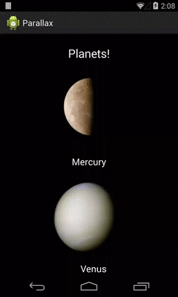
[JazzyViewPager](https://github.com/jfeinstein10/JazzyViewPager) | An easy to use ViewPager that adds an awesome set of custom swiping animations. Just change your ViewPagers to JazzyViewPagers, two more steps, and you're good to go!| None
[auto-scroll-view-pager](https://github.com/Trinea/android-auto-scroll-view-pager) | Android auto scroll viewpager or viewpager in viewpager.|
[PagerSlidingTabStrip](https://github.com/astuetz/PagerSlidingTabStrip) | An interactive indicator to navigate between the different pages of a ViewPager.|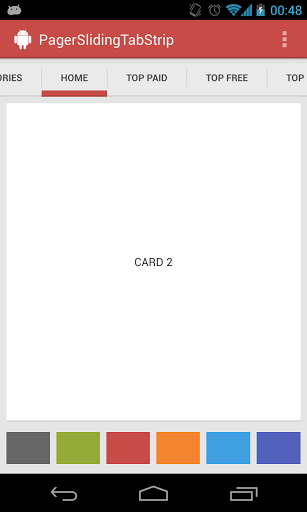
[WizardPager](https://github.com/TechFreak/WizardPager) | Wizard Pager is a library that provides an example implementation of a Wizard UI on Android, it's based of Roman Nurik's wizard pager.|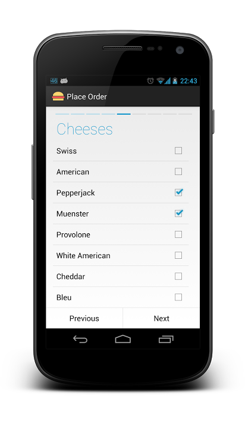
[ViewPagerTransforms](https://github.com/ToxicBakery/ViewPagerTransforms) | Library containing common animations needed for transforming ViewPager scrolling for Android v13+.|

#### <a name="slidingviews">Sliding Views
Title | Description | ScreenShot
:-----------: | :-----------: | :-----------:
[sliding-pane-layout](https://github.com/chiuki/sliding-pane-layout) | SlidingPaneLayout that is partially visible, with cross fade.|
[AndroidImageSlider](https://github.com/daimajia/AndroidImageSlider) | An amazing and convenient Android image slider.|
[AndroidSlidingUpPanel](https://github.com/umano/AndroidSlidingUpPanel) | This library provides a simple way to add a draggable sliding up panel (popularized by Google Music and Google Maps) to your Android application. Brought to you by Umano.|
[BottomSheet](https://github.com/soarcn/BottomSheet) | One way to present a set of actions to a user is with bottom sheets, a sheet of paper that slides up from the bottom edge of the screen. Bottom sheets offer flexibility in the display of clear and simple actions that do not need explanation.|
[android-sliding-layer-lib](https://github.com/wunderlist/android-sliding-layer-lib) |This repository host a library that provides an easy way to include an autonomous layer/view that slides from any side of your screen and which is fully gesture ready.| None

### <a name="dialogs">Dialogs
Title | Description | ScreenShot
:-----------: | :-----------: | :-----------:
[NiftyDialogEffects](https://github.com/sd6352051/NiftyDialogEffects) | Nifty Modal Dialog Effects.|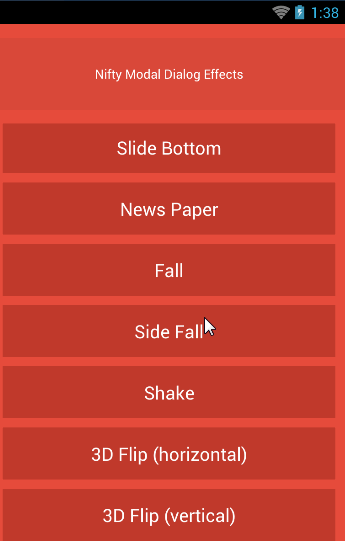
[sweet-alert-dialog](https://github.com/pedant/sweet-alert-dialog) | SweetAlert for Android, a beautiful and clever alert dialog.|
[UpdateChecker](https://github.com/rampo/UpdateChecker) | Increase your app's updates.|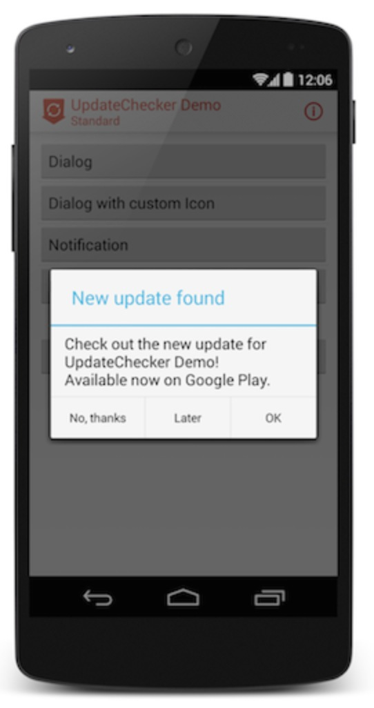

### <a name="toastsui">Toasts
Title | Description | ScreenShot
:-----------: | :-----------: | :-----------:
[NiftyNotification](https://github.com/sd6352051/NiftyNotification) | effects for android notifications.|
[SuperToasts](https://github.com/JohnPersano/SuperToasts) | A library that extends the Android toast framework.|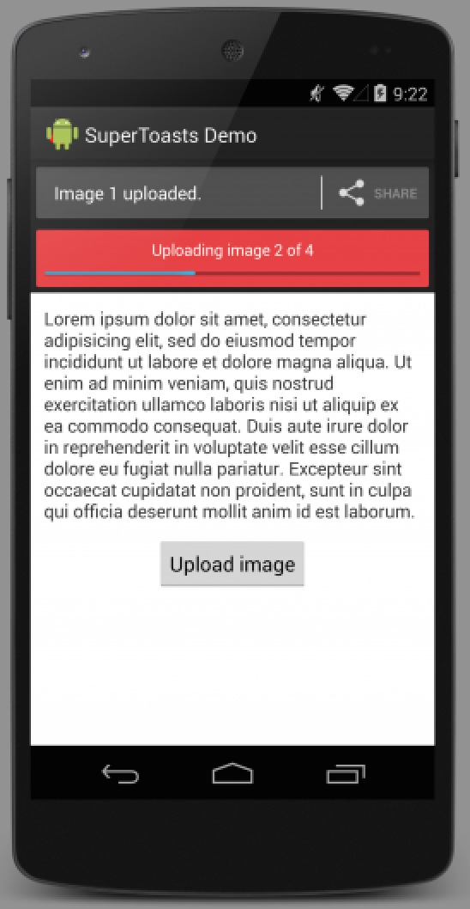
[Crouton](https://github.com/keyboardsurfer/Crouton) | Context sensitive notifications for Android.|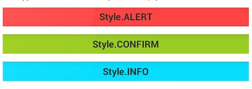

### <a name="animationui">Animation
Title | Description | ScreenShot
:-----------: | :-----------: | :-----------:
[AndroidViewAnimations](https://github.com/daimajia/AndroidViewAnimations) | Cute view animation collection.|
[AnimationEasingFunctions](https://github.com/daimajia/AnimationEasingFunctions) | Android Animation Easing Functions. Let's make animation more real!|
[FragmentTransactionExtended](https://github.com/DesarrolloAntonio/FragmentTransactionExtended) | FragmentTransactionExtended is a library which provide us a set of custom animations between fragments.|
[AndroidIndicators](https://github.com/MoshDev/AndroidIndicators) | A simple library to add some effect to screen title.|
[recyclerview-animators](https://github.com/wasabeef/recyclerview-animators) | An Android Animation library which easily add itemanimator to RecyclerView items.|
[RecyclerViewItemAnimators](https://github.com/nvanbenschoten/motion) | An Android library which provides simple Item animations to RecyclerView items.|
[transitions-everywhere](https://github.com/andkulikov/transitions-everywhere) | Backport of Transitions API for animations from Android KitKat and Lollipop. Compatible with Android 2.2+.|
[SpringIndicator](https://github.com/chenupt/SpringIndicator) | A spring indicator like Morning Routine guide.|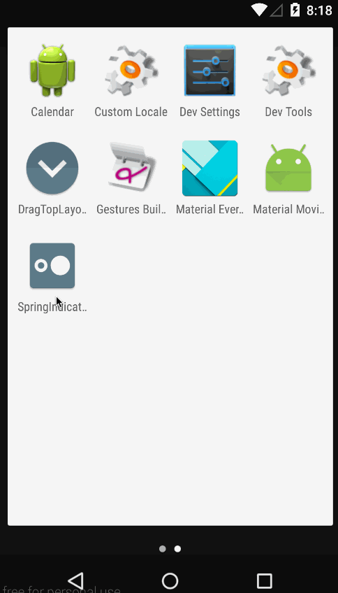
[EasyAndroidAnimations](https://github.com/2359media/EasyAndroidAnimations) | It is an animation library that aims to make android animations easier, with 50+ builtin animations, it allows you to introduce many complex animation effects with one or two lines of code.|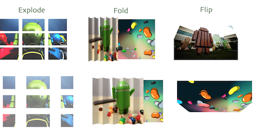
[motion](https://github.com/nvanbenschoten/motion) | An Android library allowing images to exhibit a parallax effect that reacts to the device's tilt.|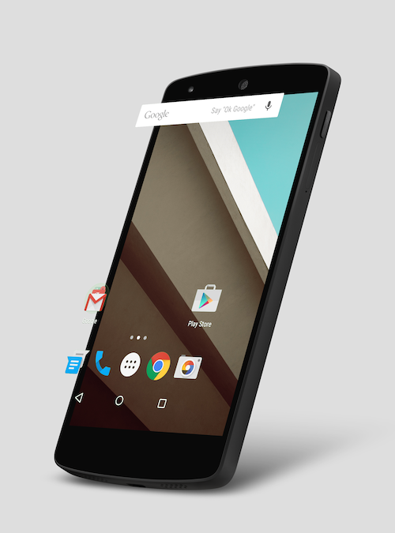
[rebound](https://github.com/facebook/rebound) | A Java library that models spring dynamics and adds real world physics to your app.| None

### <a name="chartsui">Charts
Title | Description | ScreenShot
:-----------: | :-----------: | :-----------:
[EazeGraph](https://github.com/blackfizz/EazeGraph) | An Android chart and graph library.|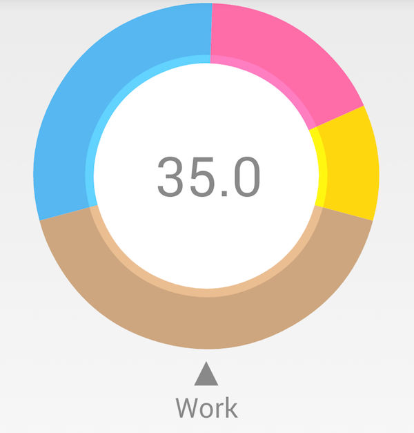

### <a name="otherui">Other

### <a name="material">Material Design
Title | Description | ScreenShot
:-----------: | :-----------: | :-----------:
[material-menu](https://github.com/balysv/material-menu) | Animation port of Android L drawer, back, dismiss and check icons.|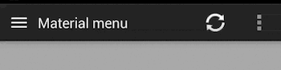
[MaterialDrawer](https://github.com/mikepenz/MaterialDrawer) | A simple take on creating an easy to use and fast material navigation drawer implementation.|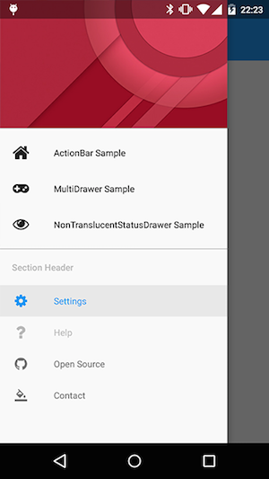
[materialish-progress](https://github.com/gabrielemariotti/RecyclerViewItemAnimators) | A material style progress wheel compatible with 2.3.|
[discreteSeekBar](https://github.com/AnderWeb/discreteSeekBar) | DiscreteSeekbar is my poor attempt to develop an android implementation of the Discrete Slider component from the Google Material Design Guidelines.|
[ListViewVariants](https://github.com/AndroidDeveloperLB/ListViewVariants) | Provides special ways to handle ListViews, including PinnedHeaderListView in Lollipop's Contacts' app style.|
[recyclerview-stickyheaders](https://github.com/eowise/recyclerview-stickyheaders) | Android library that integrate sticky section headers in your RecyclerView.| None
[SuperSLiM](https://github.com/TonicArtos/SuperSLiM) | A layout manager for the RecyclerView with interchangeable linear, grid, and staggered displays of views, all with configurable section headers including the sticky variety as specified in the material design docs.| 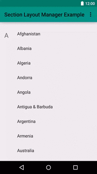
[ObservableScrollView](https://github.com/ksoichiro/Android-ObservableScrollView) | Android library to observe scroll events on scrollable views.| None
[MaterialTabs](https://github.com/neokree/MaterialTabs) | Custom Tabs with Material Design effects.| 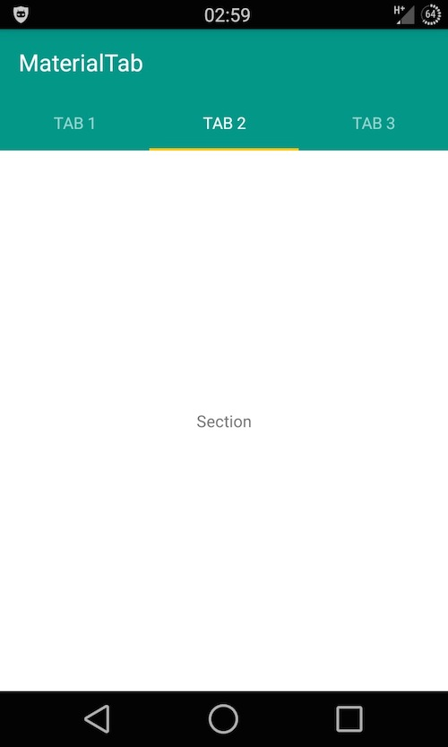
[AndroidMaterialDesignToolbar](https://github.com/tekinarslan/AndroidMaterialDesignToolbar) | Android Sample Project with Material Design and Toolbar.| 
[LDrawer](https://github.com/ikimuhendis/LDrawer) | Android drawer icon with material design animation.| 
[NavigationDrawer-Material](https://github.com/rudsonlive/NavigationDrawer-MaterialDesign) | Android drawer icon with material design animation.| 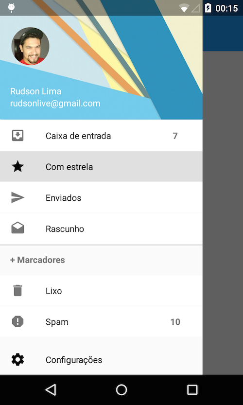
[MaterialNavigationDrawer](https://github.com/neokree/MaterialNavigationDrawer) | Navigation Drawer Activity with material design style and simplified methods.| 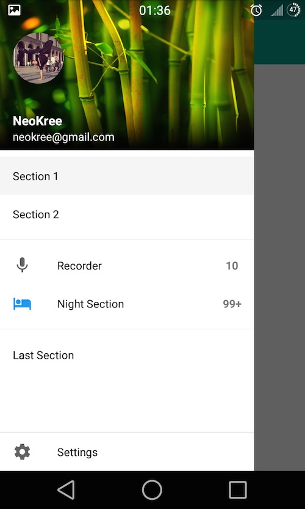
[material-dialogs](https://github.com/afollestad/material-dialogs) | A beautiful, easy-to-use, and customizable dialogs API, enabling you to use Material design themed dialogs across all versions of Android (unlike AppCompat).| 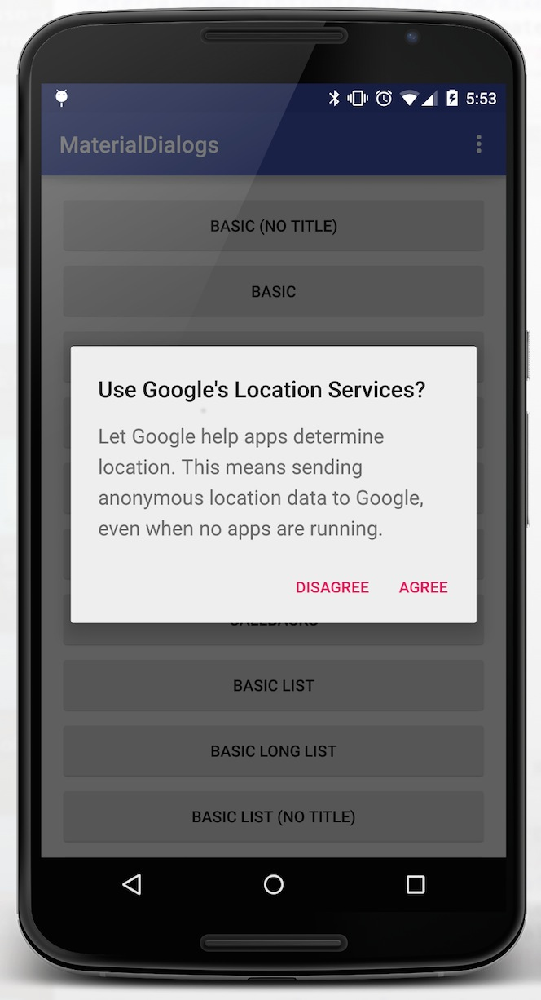
[android-styled-dialogs](https://github.com/avast/android-styled-dialogs) | Backport of Material dialogs with easy-to-use API based on DialogFragment.| 
[MaterialDialog](https://github.com/drakeet/MaterialDialog) | An Android dialog library, has strong extensibility, customizability, and for conveniently building Material Design Dialog in Android version 2.2 ~ L.| 
[floating-action-button](https://github.com/futuresimple/android-floating-action-button) | Floating Action Button for Android based on Material Design specification.| 
[material-calendarview](https://github.com/prolificinteractive/material-calendarview) | A Material-looking Android CalendarView.| 
[snackbar](https://github.com/nispok/snackbar) | Android Library that implements Snackbars from Google's Material Design documentation.| 
[SnackBar](https://github.com/MrEngineer13/SnackBar) | toast-like alert pattern for Android inspired by the Google Material Design Spec.| 

### <a name="location">Location

### <a name="social">Social

### <a name="database">DB & Preferences

#### <a name="databasecp">ContentProvider / ContentResolver / Cursor

#### <a name="databasepreferences">Preferences

#### <a name="databaseother">Other

### <a name="io">IO

### <a name="network">Network

### <a name="eventbus">Event Bus

### <a name="tasks">Tasks

### <a name="opengl">Open GL

### <a name="dependencyinjection">Dependency Injection

### <a name="testing">Testing

### <a name="reverseengineering">Reverse Engineering

### <a name="filepickers">File Pickers
